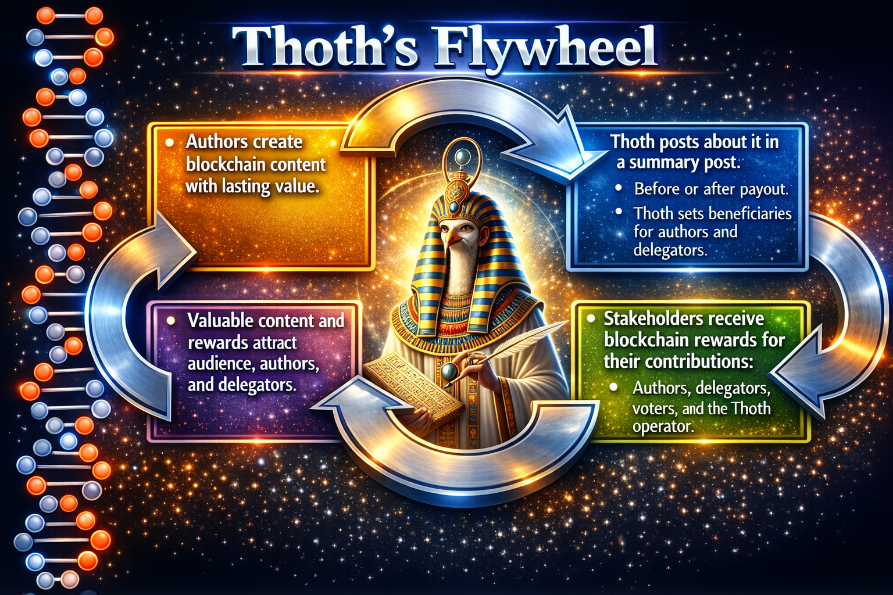

# 👋 Hello, and Welcome to my GitHub profile!  
  
I'm a hobby programmer who builds for the Steem blockchain.  I am interested in using software to optimize decentralized incentive structures in order to improve the blockchain-experience for humans.

## 🛠️ Skills & Technologies
- **Python**: Bots
- **JavaScript**: Browser extensions.
- **Steem Blockchain**: Exploring decentralized social media and content curation.

## 🚀 Top Projects

### [Thoth](https://github.com/remlaps/thoth)

Thoth can be viewed as an automated content evaluation system and incentive management engine that is built on a public blockchain.

As a first of its kind [Generation-5 voting service](https://steemit.com/steem-dev/@remlaps/here-is-a-complete-framework) for the Steem blockchain, *Thoth* integrates LLM-based evaluation and automated post summaries with programmable beneficiary rewards to align incentives among content creators, delegators, operators, and other stakeholders.

<table align="center">
  <tr>
    <td align="center">
       
      <b>Thoth Flywheel – Incentive Alignment Model</b>
    </td>
  </tr>
</table>

Rather than simply upvoting posts, Thoth uses AI and blockchain features to create a self-reinforcing incentive cycle that was designed to incubate long-term value and enhance the ecosystem for human stakeholders.

### [Steem Curation Extension](https://github.com/remlaps/steem-curation-extension)
A browser extension designed to enhance curation and user experience on Steem.  
  
You can get it from the Chrome Store: [Steem Curation Extension](https://chromewebstore.google.com/detail/steem-curation-extension/edkgjcmgiagpagmikifiecjgglccmome).

### [Alternative Methods for Base Conversion](https://github.com/remlaps/PascalTriangleBaseConversions)
A browser extension (code by Google Gemini) that implements the integer base conversion methods from [Alternative Algorithms for Base Conversion (Steve Palmer, 2007, unpublished)](https://github.com/remlaps/PascalTriangleBaseConversions/blob/master/AlternateBaseConversionAlgorithms.pdf).  These use matrix multiplication to perform vector-oriented base conversions when one base is a multiple of another or using the offset between bases.

### [Simple Steem Block Explorer](https://github.com/remlaps/steemExplorer)

View current blockchain properties or look-up Steem blocks, accounts, or transactions in a browser extension.  

You can get it from the Chrome Store: [Simple Steem Block Explorer](https://chromewebstore.google.com/detail/klmfogefhmmekdbdaipnajnbhodocndg?utm_source=item-share-cb)

## 📫 More

- Check out my projects and updates on Steemit:  
  [https://steemit.com/@remlaps](https://steemit.com/@remlaps)

---
